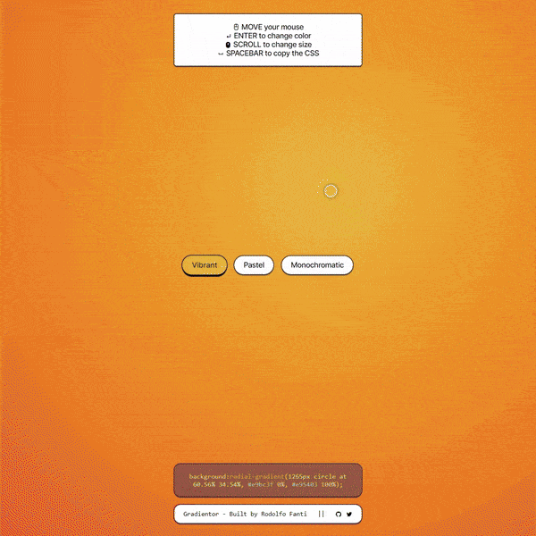

[](https://visitorbadge.io/status?path=https%3A%2F%2Fgithub.com%2FRuDeeVelops%2Fgradientor-app%2F)&nbsp;&nbsp;&nbsp;&nbsp;


# Gradientor.app - A minimalist, beautiful Radial Background Generatorr

### Tech stack: `JS` `css` `html`

### Live link: https://gradientor.app

<p align="center">
    
</p>

<i>"I know we already have hundreds of gradient generators... what's special about this one then?</i>

### Main features

- A 100% mouse driven radial background generator.
- Based on `mousemove` and `mousewheel` events.
- A color palette logic will always randomize beautiful and infinite gradient combinations.
- User can visualize the output CSS in a "terminal-like" window and copy the output.

## Core Functions

## Color logic: `generateHSLColor`, color palettes and `generateGradientColors`

```javascript
// Let's create an HSL color generator converting custom parameters to valid CSS HSL syntax
// We'll be using the custom parameters to generate different color palettes
function generateHSLColor(
  saturationMin,
  saturationMax,
  lightnessMin,
  lightnessMax,
  hue = Math.floor(Math.random() * 360) // If hue is undefined, generate a random hue.
) {
  const saturation = saturationMin + Math.random() * (saturationMax - saturationMin);
  const lightness = lightnessMin + Math.random() * (lightnessMax - lightnessMin);
  return `hsl(${hue}, ${saturation}%, ${lightness}%)`;
}

// Let's define a few color palettes to generate colors from, using our custom parametres and explicit hue for the monochromatic palette only
function vibrantColor() {
  return generateHSLColor(70, 100, 40, 60); // saturation between 70% and 100% and lightness between 40% and 60%
}
function pastelColor() {
  return generateHSLColor(10, 50, 70, 80); // lower saturation for softer colors and high lightness for pastel effect
}
function monochromaticColor(hue) {
  return generateHSLColor(50, 100, 10, 100, hue); // medium to high saturation and lightness but explicit hue
}

// Create two random colors based on the currentPalette we just defined
// Every time we call currentPalette(), it will generate a new color based on the currentPalette function
function generateGradientColors() {
  // If the current palette is monochromatic, generate a random hue BUT USE IT FOR BOTH COLORS
  if (currentPalette === monochromaticColor) {
    const hue = Math.floor(Math.random() * 360);
    currentColor1 = currentPalette(hue);
    currentColor2 = currentPalette(hue);
  } else {
    currentColor1 = currentPalette();
    currentColor2 = currentPalette();
  }
  paintGradient(cursorCircle.offsetLeft, cursorCircle.offsetTop);
}
```

## Painting the gradient at mouse position

```javascript
// Update the gradient based on the current colors and mouse position - also apply that gradient to the currently selected button
function paintGradient(
  x = window.innerWidth / 2, // if x and y are undefined, use the center of the window.
  y = window.innerHeight / 2
) {
  const xPercent = (x / window.innerWidth) * 100; // Convert position to a percentage of the window width
  const yPercent = (y / window.innerHeight) * 100;
  gradientString = `radial-gradient(${gradientSizePx}px circle at ${xPercent.toFixed(2)}% ${yPercent.toFixed(
    2
  )}%, ${currentColor1} 0%, ${currentColor2} 100%)`; // Create the gradient CSS syntax string, limit % to 2 decimal places
  gradientElement.style.background = gradientString; // Apply the gradient background

  if (currentButton) {
    currentButton.style.background = gradientString; // Apply the gradient background to the current button
  }

  updateCssOutput(xPercent, yPercent); // Update the CSS output in the custom terminal and pass it the current mouse position
}
```
